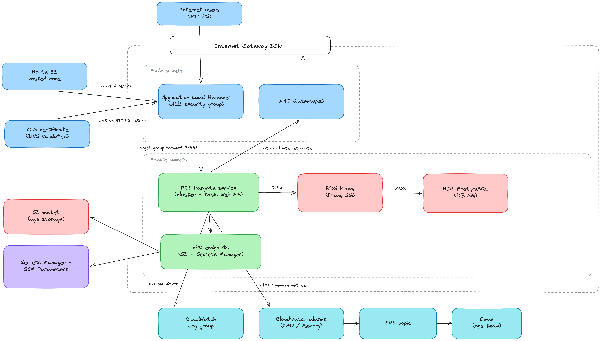
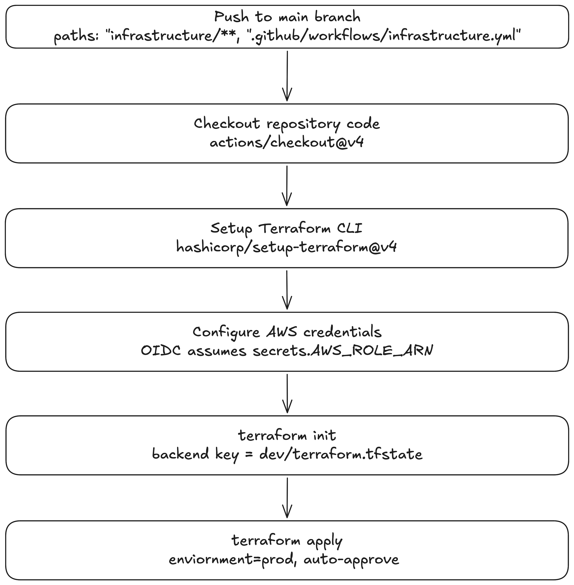
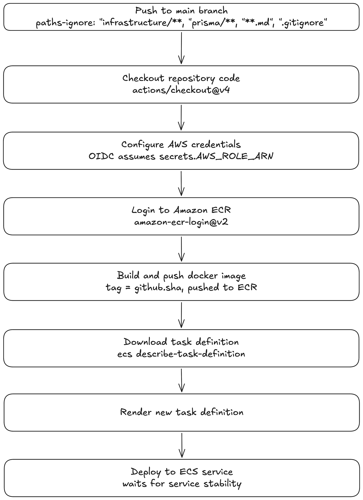
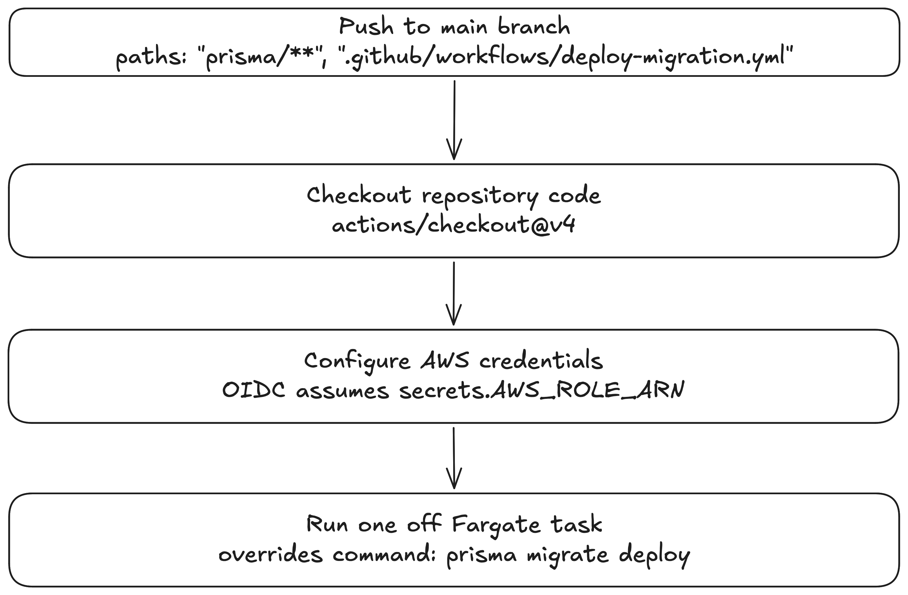

# Cursus LMS. Automated AWS Infrastructure & CI/CD Platform


A production-ready, serverless container platform deployed on **AWS ECS Fargate**, managed entirely through **Terraform** (Infrastructure as Code) and automated with a **3-pipeline GitHub Actions architecture** authenticated securely via OpenID Connect (OIDC).

🌐 **Live Platform:** [https://cursus.didheemose.dev](https://cursus.didheemose.dev)

---

## 🏗️ System Architecture



The platform is engineered around a zero-trust, highly available AWS topology featuring strict VPC network boundaries, serverless container orchestration, and real-time operational feedback loops:

- **Edge & Routing:** Public HTTPS traffic enters through **Route 53** and terminates TLS at an **AWS ACM Certificate** mounted on an **Application Load Balancer (ALB)**.
- **Serverless Compute:** Traffic is forwarded (Port 3000) from the ALB to **AWS ECS Fargate tasks** in isolated **Private Subnets**. Outbound traffic routes via **NAT Gateways**.
- **Database & Caching Layer:** Data persistence uses **Amazon RDS PostgreSQL** fronted by **RDS Proxy** (Port 5432) for connection pooling and security isolation.
- **Storage & Secrets:** Static assets reside in **Amazon S3**, while app secrets are standard-managed via **AWS Secrets Manager & SSM Parameter Store** via private **VPC Endpoints**.
- **Observability Loop:** Containers stream logs via `awslogs` to **CloudWatch Log Groups**. **CloudWatch Alarms** continuously monitor CPU/Memory metrics and trigger alert notifications to an **AWS SNS Topic** to notify the team via email.

---

## 🚀 CI/CD Pipeline Architecture

Automation is decoupled into three distinct, event-driven GitHub Actions workflows. Every pipeline uses **GitHub OIDC** to assume temporary AWS IAM roles (`secrets.AWS_ROLE_ARN`), eliminating long-lived static AWS credentials.

---

### 1. Infrastructure Pipeline Workflow

Triggered on pushes modifying `infrastructure/**` or `.github/workflows/infrastructure.yml`.



- **Code Checkout:** Executes `actions/checkout@v4`.
- **CLI Initialization:** Configures Terraform CLI using `hashicorp/setup-terraform@v4`.
- **Secretless Auth:** Authenticates via OIDC to assume `secrets.AWS_ROLE_ARN`.
- **Backend Setup:** Initializes remote state storage using `terraform init` (Backend key: `dev/terraform.tfstate`).
- **State Provisioning:** Automatically applies infrastructure updates across resources with `terraform apply` (environment=prod, auto-approve).

---

### 2. Application Deployment Pipeline Workflow

Triggered on pushes to `main`, explicitly ignoring non-application paths (`infrastructure/**`, `prisma/**`, `**.md`, `.gitignore`).



- **Code Checkout & Auth:** Checks out codebase (`actions/checkout@v4`) and assumes AWS IAM role via OIDC (`secrets.AWS_ROLE_ARN`).
- **ECR Registry Login:** Authenticates Docker CLI against Amazon ECR using `amazon-ecr-login@v2`.
- **Container Build & Push:** Packages Docker container, tags image with Git commit SHA (`github.sha`), and pushes artifact to Amazon ECR.
- **Task Definition Render:** Downloads existing ECS task definition via `ecs describe-task-definition` and renders the new revision.
- **Zero-Downtime Deployment:** Deploys new revision to ECS service and waits for service stability.

---

### 3. Database Migration Pipeline Workflow

Triggered on pushes modifying `prisma/**` or `.github/workflows/deploy-migration.yml`.



- **Code Checkout & Auth:** Checks out repository (`actions/checkout@v4`) and assumes AWS IAM role via OIDC (`secrets.AWS_ROLE_ARN`).
- **Ephemeral Task Execution:** Runs a one-off standalone AWS ECS Fargate task inside private VPC subnets.
- **Prisma Command Override:** Overrides container command to safely run schema migrations:
  ```bash
  prisma migrate deploy
  ```
- **Isolated Termination:** Runs directly against RDS Proxy and automatically terminates upon completion.

---

## 📊 Observability & Incident Monitoring

System health and compute metrics are monitored natively via Terraform (`monitoring.tf`):

- **Centralized Container Logs:** Standard stdout/stderr streams are captured via `awslogs` and shipped to CloudWatch Log Groups.
- **Container Insights:** Detailed CPU, RAM, and network throughput metrics tracked at the ECS Cluster layer.
- **Proactive Threshold Alerting:** Automated CloudWatch Alarms continuously sample service telemetry, notifying engineering through AWS SNS:
  - ⚠️ **High CPU Utilization Alarm:** Triggers when ECS service CPU exceeds 85% over two 5-minute evaluation periods.
  - ⚠️ **High Memory Utilization Alarm:** Triggers when ECS service Memory exceeds 90% over two 5-minute evaluation periods.

---

## 🔐 Zero-Downtime Secret Management

Runtime parameters and credentials are managed through AWS Systems Manager (SSM) Parameter Store. To rotate production secrets without downtime:

```bash
# 1. Update parameter in SSM Parameter Store
aws ssm put-parameter --name "/cursus-lms/pusher/secret" --value "NEW_SECRET_VALUE" --type "String" --overwrite

# 2. Trigger zero-downtime rolling service refresh
aws ecs update-service \
  --cluster cursus-lms-cluster \
  --service cursus-lms-service \
  --force-new-deployment
```

---

## 🛠️ Tech Stack & Tools

- **Cloud Provider:** Amazon Web Services (AWS)
- **Compute & Orchestration:** AWS ECS Fargate, Amazon ECR, Docker
- **Infrastructure as Code:** Terraform
- **CI/CD & Security:** GitHub Actions, OpenID Connect (OIDC), AWS IAM Roles
- **Database & ORM:** PostgreSQL (Amazon RDS), RDS Proxy, Prisma ORM
- **Networking & Security:** Route 53, ACM, ALB, VPC Private Subnets, AWS SSM Parameter Store, Secrets Manager
- **Observability:** AWS CloudWatch, Container Insights, AWS SNS

---

## 📄 License

This project is open-source and available under the [MIT License](LICENSE).
